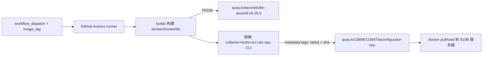

## 需求概述

为本仓库（aiconfigurator-npu，Ascend 910B 算子采集 + 配置搜索工具）补齐容器化交付能力：

## 用户需求

- 编写一个 `Dockerfile`，镜像内包含完整的采集环境（CANN/torch-npu/vllm-ascend 底座）与本项目代码（collector、tools、搜索引擎）
- 创建 GitHub Actions 工作流，手动触发（workflow_dispatch）后在 GitHub 上构建镜像，并推送到个人镜像仓库
- 用户提供了参考工作流模板：quay.io 注册表、`QUAY_USERNAME`/`QUAY_PASSWORD` secrets、buildx 构建、gha 构建缓存、metadata-action 打 tag（`type=raw` 用户输入 tag + `type=sha` 短哈希）

## 产品形态

- 新增 `docker/Dockerfile`：基于 `quay.io/ascend/vllm-ascend:v0.18.0`（与项目要求的 vLLM 0.18.0 对齐，内置 CANN 8.5+/torch-npu/vllm-ascend），拷贝 `collector/`、`tools/`、`model_configs/`、`src/`、`pyproject.toml`、`README.md`，执行 `pip install -e .`，设置 `HF_HUB_OFFLINE=1`、`TRANSFORMERS_OFFLINE=1`、`PYTHONPATH=collector` 环境变量，默认工作目录 `/workspace`，预创建 `data/` 输出目录
- 新增 `.dockerignore`：排除 `.git`、缓存、本地数据输出等无关内容，减小构建上下文
- 新增 `.github/workflows/build-image.yml`：沿用参考工作流结构（concurrency 防并发、buildx、quay.io 登录、metadata 打 tag、gha 缓存、digest 输出），去掉本仓库用不到的 git lfs 步骤与多 Dockerfile choice 输入（当前仅一个 Dockerfile），镜像名沿用个人命名空间 `18896723947/aiconfigurator-npu`
- 产出镜像可在 910B 服务器 `docker load/pull` 后配合设备挂载运行采集器（910B 侧运行命令此前已给出，不在本次范围）

## 核心功能

- 一键构建包含采集器与搜索引擎的 Ascend NPU 运行镜像
- GitHub 手动触发构建并以用户指定 tag + commit sha 双 tag 推送到 quay.io 个人仓库

## 技术方案

### 技术选型

- 基础镜像：`quay.io/ascend/vllm-ascend:v0.18.0`（对齐项目 README 要求的 vLLM 0.18.0 + vllm-ascend + CANN 8.5+ + torch-npu，免去在 GitHub runner 上安装 CANN 的复杂工作；GitHub amd64 runner 拉取基础镜像即可构建，无需真实 NPU 硬件）
- CI：GitHub Actions（`actions/checkout@v5`、`docker/setup-buildx-action@v3`、`docker/login-action@v3`、`docker/metadata-action@v5`、`docker/build-push-action@v5`，与用户参考模板版本一致）
- 注册表：quay.io，镜像 `18896723947/aiconfigurator-npu`，认证走仓库 secrets `QUAY_USERNAME`/`QUAY_PASSWORD`

### 实现方式

1. `docker/Dockerfile`（单阶段）：

- `FROM quay.io/ascend/vllm-ascend:v0.18.0`
- `WORKDIR /workspace`，COPY 必要子目录（collector/tools/model_configs/src + pyproject.toml + README.md），不整仓拷贝
- `pip install --no-cache-dir -e .`（安装 `aic-npu` CLI；纯 Python 依赖 numpy/pandas 等，基础镜像内可解析）
- `ENV HF_HUB_OFFLINE=1 TRANSFORMERS_OFFLINE=1 PYTHONPATH=/workspace/collector`（对齐 `docs/DSA_COLLECTION_COMMANDS.md` 的运行要求；GLM-5 配置已离线存在于 `model_configs/`）
- `RUN mkdir -p /workspace/data` 预建采集输出目录，`CMD ["/bin/bash"]`

2. `.dockerignore`：排除 `.git/`、`__pycache__/`、`*.pyc`、`data/`、`docs/`、`.github/` 等，控制构建上下文体积并提升缓存命中
3. `.github/workflows/build-image.yml`：

- 触发：`workflow_dispatch`，inputs 仅保留 `image_tag`（默认 `latest`）；Dockerfile 固定为 `docker/Dockerfile`，不设 choice 输入
- `concurrency.group = workflow-事件`，`cancel-in-progress: false`
- 步骤：checkout（`fetch-depth: 0`，无 LFS 需求故不启用 lfs）→ setup-buildx → login quay.io（secrets）→ metadata-action（`type=raw,value=${{ inputs.image_tag }}` + `type=sha,prefix=`）→ build-push（context=.，push=true，`cache-from/to type=gha`）→ 输出 digest
- `timeout-minutes: 120`，`permissions: contents: read`

### 性能与可靠性

- gha 缓存 `mode=max` 复用基础镜像层与 pip 层，重复构建显著提速
- 构建（amd64、无 NPU）只保证依赖与环境就位；NPU 功能验证需在 910B 上运行 `tools/check_vllm_compat.py` 与 `npu-smi`，README 中注明
- secrets 不落日志；推送失败由 Actions 步骤级失败终止

### 架构



### 目录结构

```
aiconfigurator-npu/
├── docker/
│   └── Dockerfile                 # [NEW] 单阶段镜像：vllm-ascend 底座 + 本项目代码与依赖
├── .dockerignore                  # [NEW] 排除 .git/缓存/本地数据，控制构建上下文
├── .github/
│   └── workflows/
│       └── build-image.yml        # [NEW] 手动触发构建并推送 quay.io 个人仓库
└── README.md                      # [MODIFY] 追加“镜像构建与 910B 运行”章节（构建命令、secrets 配置、docker run 设备挂载示例）
```